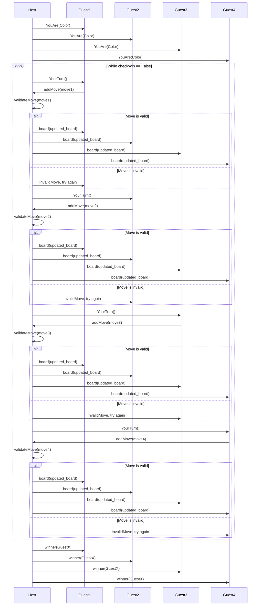

# Échecs à 4 joueurs :

---

## Règles du jeu

---

Les échecs à 4 constituent une variante jouée par quatre personnes 
en même temps et sur le même échiquier.

Chaque joueur a une couleur différente pour son jeu de pièces, 
à savoir rouge, bleu, jaune et vert. La partie commence toujours par les rouges et se poursuit 
dans le sens des aiguilles d'une montre. 
Une autre différence majeure des échecs à 4 joueurs est l'échiquier, 
qui compte 160 cases car trois rangées supplémentaires sont ajoutées de chaque côté.

## **Règles standards des échecs à 4 joueurs en mode libre**

---

L'une des variantes les plus connues des échecs à 4 joueurs est le mode libre. 
Comme vous pouvez le deviner par son nom, dans ce type d'affrontement, 
chacun des quatre joueurs se bat seul contre les trois autres.

Le but de cette variante est de terminer la partie avec plus de points que ses adversaires. 
Il existe de nombreuses façons pour un joueur de gagner des points :

- En matant un adversaire (+20)
- En se mettant en situation de pat (+20)
- En mettant en situation de pat un adversaire 
(+10 pour chaque joueur encore dans la partie)
- En faisant échec à plus d'un roi simultanément avec la dame 
(+1 pour deux roi, +5 pour trois rois)
- En faisant échec à plus d'un roi simultanément avec une autre pièce que la dame 
(+5 pour deux rois, +20 pour trois rois)
- En capturant des pièces actives 
(+1 pour un pion ou une dame promue, +3 pour un cavalier, +5 pour un fou, 
+5 pour une tour et +9 pour la dame, 
les super-pièces correspondantes rapportent deux fois plus de points)

Comme aux échecs classiques, les pions sont promus 
lorsqu'ils atteignent la huitième rangée d'un joueur. 
Cependant, dans les parties standard en mode libre, un pion est automatiquement promu en dame. 
Si elle est capturée, cette dame ne rapporte qu'un point au joueur qui la prend.

## **Règles spéciales : super-pièces et écrasement**

---

Durant la partie, il sera possible de fusionner deux pièces aliés pour créer une super-pièce. 
Ces super-pièces prennent plusieurs cases sur le plateau et se déplacent avec des mouvements qui leur sont propres. 
Ces déplacements sont insensibles au chevauchement, c'est à dire que toutes les super-pièces peuvent, comme le cavalier,
passer au dessus d'autres pièces si celles ci sont dans leur chemin. 

La mécanique d'écrasement est introduite avec les super-pièces et toutes les super pièces en sont dotées.
Cette mécanique écrase toutes les pièces sur le chemin d'une super-pièce lorsque celle ci se déplace 
y compris les pièces alliées et les autres super pièces (si elle touche une case appartenant à l'autre super-pièce)

Principes généraux :

Immunité aux pièces ordinaires :

Une super pièce ne peut pas être capturée par une pièce ordinaire. Elle ne peut être capturée que par une autre super pièce.
Pouvoir "écrasant" :

Une super pièce traverse toutes les pièces sur son passage, qu'elles soient alliées ou ennemies, et les élimine.
Cependant, elle ne peut pas traverser ni capturer directement un roi (allié ou ennemi). Elle peut néanmoins mettre un roi en échec, voire échec et mat.
Fusion pour créer une super pièce :

Une super pièce est créée par la fusion de deux pièces identiques du même camp. La fusion s’effectue de la manière suivante :
Super tour : Une tour "mange" une autre tour alliée ; la super tour naît sur la case où la tour a été capturée.
Super cavalier : Un cavalier "mange" un autre cavalier allié.
Super fou : Exception : les deux fous du même camp doivent se trouver sur des cases de couleurs différentes, côte à côte à une distance d’une case (pas en diagonale). La super pièce naît sur une des cases occupées par les deux fous.
Super reine : Il faut promouvoir une deuxième reine pour effectuer la fusion avec une reine existante.
Caractéristiques des supers pièces :

Super tour :

Se déplace en ligne droite (verticalement ou horizontalement).
Portée : 3 cases dans n'importe quelle direction.
Super fou :

Se déplace en diagonale.
Portée : 3 cases dans n'importe quelle direction.
Super cavalier :

Se déplace comme un roi, soit d'une case dans n'importe quelle direction (horizontalement, verticalement, ou diagonalement).
Super reine :

Combine les mouvements de la super tour et du super fou.
Se déplace en ligne droite (verticalement, horizontalement ou diagonalement).
Portée : 3 cases dans n'importe quelle direction.

## **EndGame et conditions de victoire**

---

Au cours de la partie, un joueur est éliminé s'il abandonne, 
s'il se retrouve pat, s'il se fait mater ou si son temps est écoulé.

Lorsqu'un joueur abandonne ou perd au temps, son roi reste en vie et se déplace au hasard. 
Mater un roi rapporte 20 points au joueur qui l'exécute tandis que le pat est récompensé 
de 10 points pour chaque joueur actif restant.

Lorsqu'un joueur se fait mater ou pater, toutes ses pièces deviennent inactives et sont grisées. 
La capture de ces pièces ne rapporte aucun point.

En cas de nulle par triple répétition, par manque de matériel ou par la règle des 50 coups, 
tous les joueurs actifs reçoivent 10 points chacun.

La partie se termine lorsque trois joueurs sont éliminés. 
En outre, une partie peut se terminer lorsqu'il ne reste que deux joueurs et que l'un d'entre eux 
a une avance de 21 points ou plus sur le tableau d'affichage. 
Ce joueur peut revendiquer la victoire en abandonnant et en accordant 20 points à l'autre joueur 
qui ne pourra pas le rattraper.

# Description du plateau

Les coins (3x3 cases) sont des zones non jouables, marquées par #.
Les zones jouables sont marquées par - si elles sont vides.
Chaque camp est symétrique et dispose ses pièces standard comme suit :
En haut (jaune) :
1ère ligne : R N B K Q B N R
2ème ligne : P P P P P P P P
En bas (rouge) :
13ème ligne : P P P P P P P P
14ème ligne : R N B Q K B N R
À gauche (bleu) :
Pièces disposées de haut en bas avec :
R sur la 4ème ligne, suivi de N B K Q B N R jusqu'à la 11ème ligne.
Pions P alignés sur la 3ème colonne de la 4ème à la 11ème ligne.
À droite (vert) :
Pièces disposées de bas en haut avec :
R sur la 4ème ligne, suivi de N B Q K B N R jusqu'à la 11ème ligne.
Pions P alignés sur la 12ème colonne de la 4ème à la 11ème ligne.

La couleur des pièces est indiquée par un chiffre avec la lettre, rouge :1 , vert :2 , jaune :3 et bleu:4 par exemple 1P est un pion rouge

# Protocole réseau

